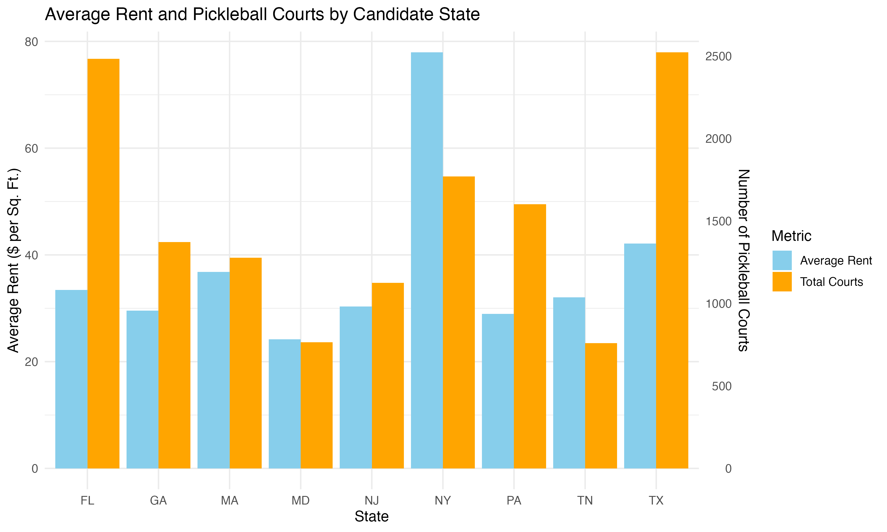
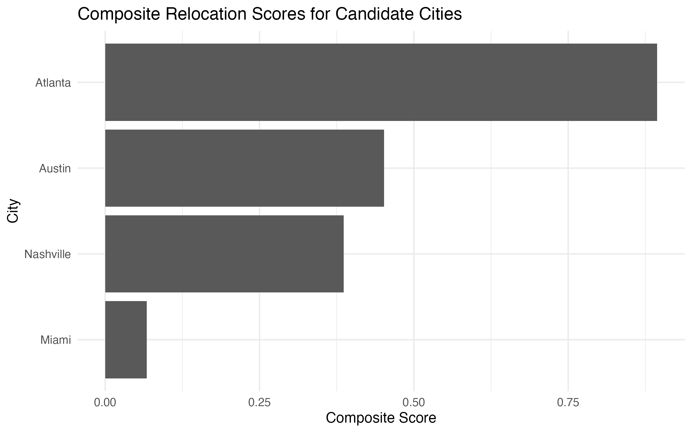
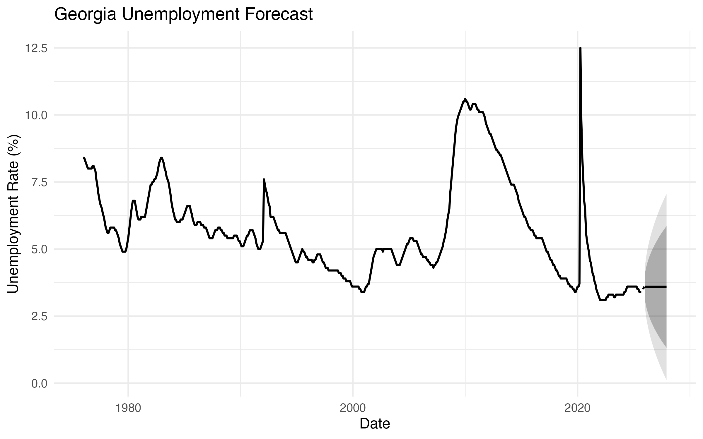
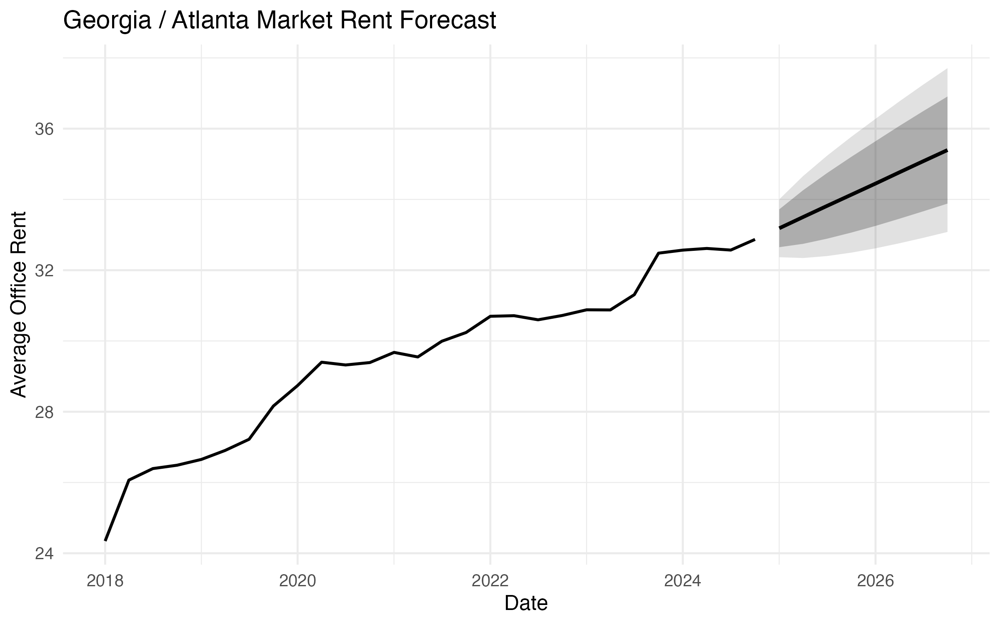

# Corporate Relocation DataFest

A DataFest hackathon project evaluating relocation options for a large technology company using office rent, lease activity, labor-market conditions, and amenity availability.

## Overview

This project was completed for **DataFest**, a 48-hour data-analysis competition. Our team evaluated potential relocation destinations for a large technology company seeking alternatives to high-cost California markets.

The analysis focused on identifying states and cities outside the western United States that could offer:

- lower office rent
- large urban office space
- stronger labor-market conditions
- a meaningful technology presence
- access to amenities such as pickleball courts

Our team received a **Best Visualization** award for this project.

## Project Questions

- Which states offer lower office rent while still providing strong amenities and office availability?
- How do candidate states compare on pickleball-court availability?
- What do recent unemployment trends suggest about labor-market conditions in candidate states?
- Which cities perform best when scored on rent affordability, unemployment, office supply, and tech presence?

## Data Sources

This repository combines several sources of data:

- office **price and availability** data
- **lease-level** commercial real estate data
- state unemployment data downloaded from **FRED**
- pickleball court counts scraped from **Places2Play**

## Methods

The project combines:

- data cleaning and integration across multiple real estate and labor-market datasets
- web scraping for pickleball court counts by state
- state-level comparison of office rent and amenities
- time series forecasting for unemployment and rent trends
- weighted composite scoring for city-level recommendation

## Final Recommendation

Using the final scoring framework, **Atlanta** ranked as the top relocation candidate among the shortlisted cities.

Atlanta performed well because it combined:

- strong office supply in an urban market
- competitive rent relative to California benchmarks
- favorable labor-market conditions
- solid technology-sector presence

## Repository Structure

- `presentation/` – final DataFest presentation
- `code/` – cleaned R scripts for loading, scraping, forecasting, scoring, and visualization
- `figures/` – final exported figures used in the analysis and README
- `data/raw/` – raw input data files, if shareable
- `data/processed/` – cleaned datasets produced by the scripts
- `output/` – forecast outputs and city scoring results
- `notes/` – project notes and assumptions

## Main Scripts

- `01_load_and_clean_data.R` – loads and cleans the rent and lease datasets
- `02_pickleball_courts_scrape.R` – scrapes and cleans pickleball court counts by state
- `03_state_comparison_visuals.R` – compares office rent and pickleball court availability across candidate states
- `04_unemployment_rent_forecast.R` – combines FRED unemployment files and creates unemployment and rent forecasts
- `05_city_scoring.R` – computes weighted city scores and identifies the top relocation candidate

## Selected Figures

<h3>State Comparison: Office Rent and Pickleball Courts</h3>

<h3>Composite Relocation Scores for Candidate Cities</h3>

<h3>Georgia Unemployment Forecast</h3>

<h3>Georgia / Atlanta Market Rent Forecast</h3>

## Scoring Framework

Candidate cities were scored using a weighted composite index:

- **Tech Presence** – 40%
- **Rent Affordability** – 20%
- **Unemployment** – 20%
- **Office Supply** – 20%

This weighting reflects the project goal of balancing labor-market strength and business ecosystem fit with affordability and real estate availability.

## Key Takeaways

- Candidate states in the Southeast and Sun Belt offered lower office rent than California benchmarks.
- Pickleball court availability provided an additional quality-of-life and amenities indicator.
- State unemployment data helped capture recent labor-market conditions.
- Atlanta ranked highest in the final city-level scoring framework.

## Team

- Daniel Padilla
- Prabhjyot Grewal
- Shrusthi HC

## Notes

This repository is a cleaned portfolio version of the original 48-hour hackathon project. Some parts of the analysis were reconstructed from the original presentation and remaining code after the competition.
